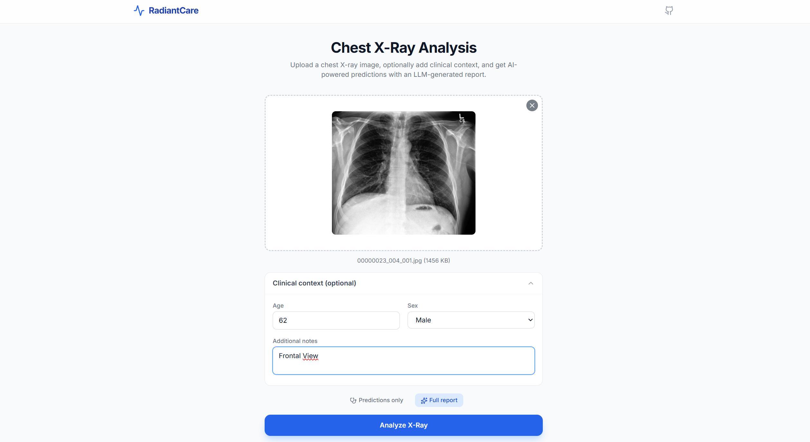
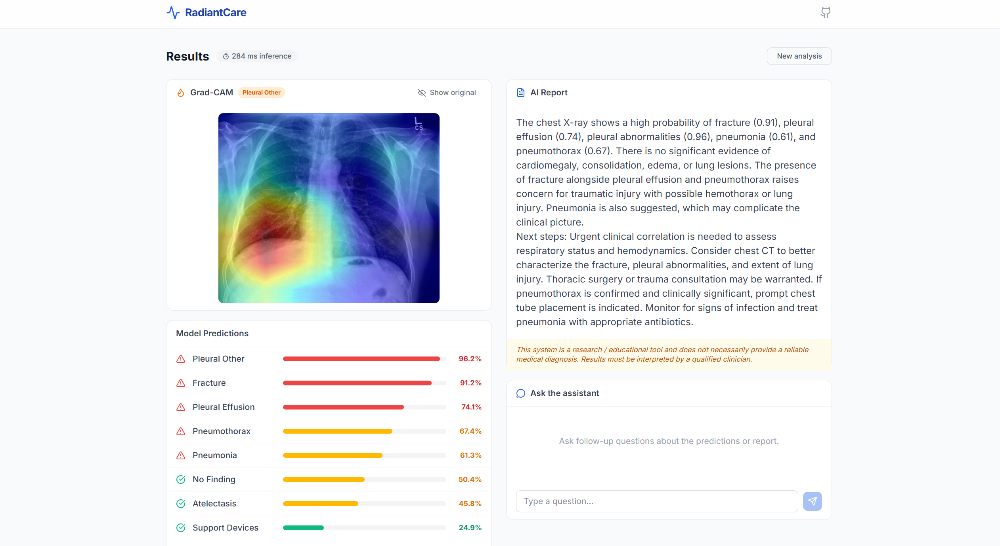
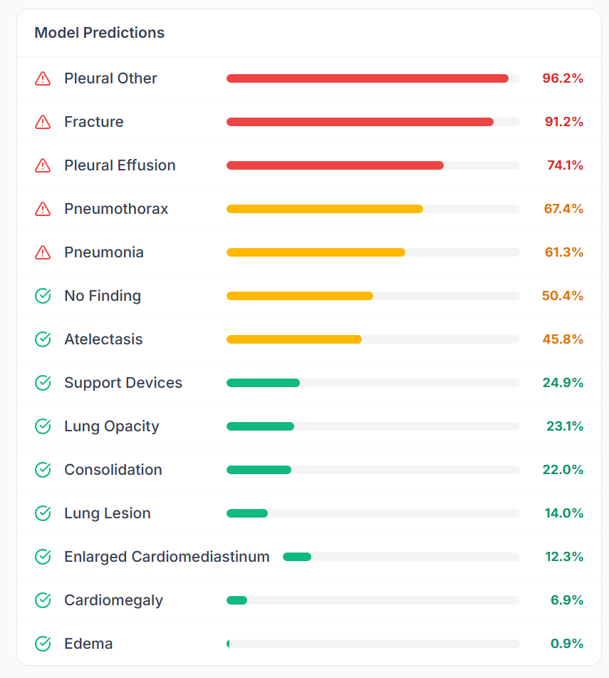
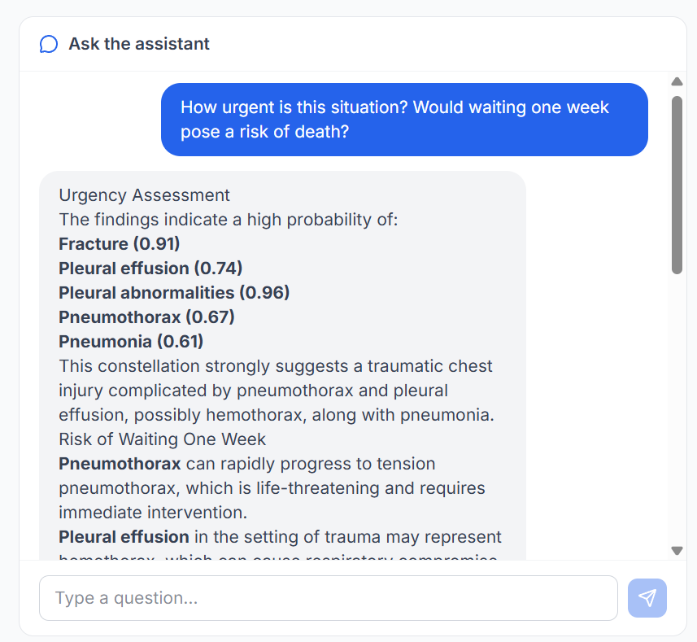
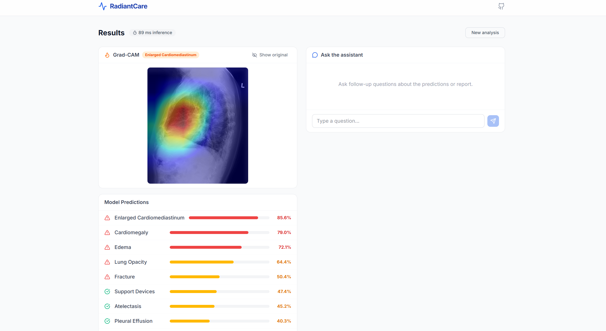
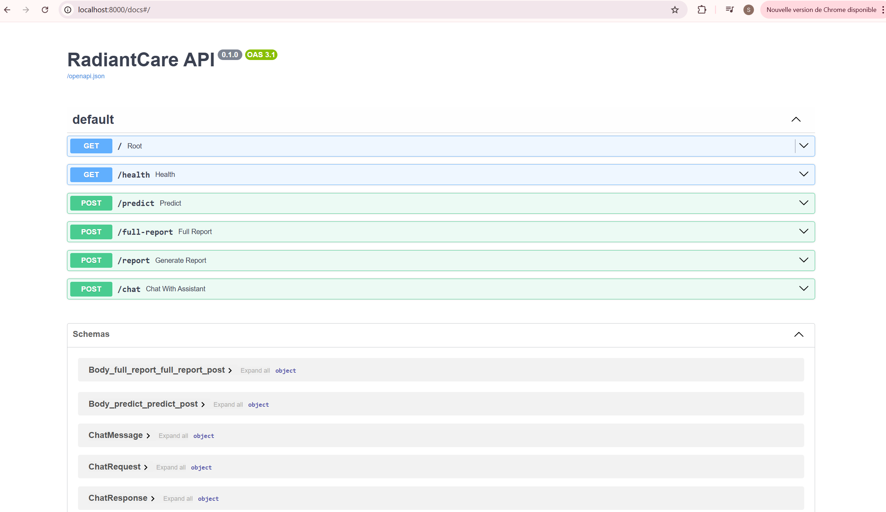

# RadiantCare

**AI-powered chest X-ray analysis** — upload a chest X-ray, get multilabel pathology predictions with Grad-CAM heatmaps, and receive an LLM-generated clinical report augmented with RAG.

Built by **SulaimanFY** — 2026.

This project is **open-source** and the backend code (`main.py`, `rag.py`, `gradcam.py`) is **thoroughly commented line-by-line** for readability, learning, and reproducibility.

---

## Screenshots

**1. Upload and setup screen**

The user uploads a chest X-ray image, displayed with its filename and size. They can optionally fill in clinical context such as age, sex, and additional notes. Before running the analysis, they choose between "Predictions only" for a faster result or "Full report" for a complete AI-generated medical report.



**2. Full analysis result**

After selecting "Full report," the result page displays the X-ray overlaid with a Grad-CAM heatmap highlighting the region most relevant to the top prediction. On the right, an AI-generated report summarizes findings with probabilities, suggests next steps, and includes a medical disclaimer. Below the heatmap, all model predictions are listed with color-coded confidence bars. A chat panel is available for follow-up questions. Inference time (e.g. around 284 ms) is shown in the header.



**3. Full list of model predictions**

A closer look at the complete list of predictions returned by the model. Each condition is shown with a confidence percentage, a color-coded bar (red for high risk, orange for moderate, green for low), and a warning or check icon for quick visual triage.



**4. Chat and urgency assessment**

The built-in chat assistant answers a follow-up question about urgency. It returns a structured assessment listing detected conditions with their probabilities, then explains the specific risks of delaying care, such as pneumothorax progressing to life-threatening tension pneumothorax or pleural effusion potentially representing hemothorax.



**5. Predictions-only mode result**

When the user selects "Predictions only," the analysis runs significantly faster (around 89 ms versus 284 ms in full-report mode). The result page shows the Grad-CAM heatmap and the list of predictions without generating a written report, making it well suited for quick screening when a detailed narrative is not needed.



**6. API documentation**

The Swagger UI documents the RadiantCare REST API built with FastAPI. It lists all available endpoints (health check, prediction, full report generation, standalone report, and chat) along with their request and response schemas, enabling straightforward integration into other systems or workflows.



---

## What it does

1. **Image upload** — drag & drop or browse a chest X-ray (PNG/JPG).
2. **14-class prediction** — a DenseNet-121 model trained on a de-identified chest X-ray dataset with a CheXpert-style 14-label schema outputs a probability for each pathology (Atelectasis, Cardiomegaly, Consolidation, Edema, Enlarged Cardiomediastinum, Fracture, Lung Lesion, Lung Opacity, No Finding, Pleural Effusion, Pleural Other, Pneumonia, Pneumothorax, Support Devices).
3. **Grad-CAM heatmap** — highlights the regions of the image that most influenced the model's top prediction.
4. **AI report** — an LLM (GPT-4.1-mini via OpenAI API) summarizes findings, flags red flags, and suggests next steps. The prompt is enriched with Retrieval-Augmented Generation (RAG) from a local pathology knowledge base.
5. **Chat** — ask follow-up questions about the case; the LLM has access to predictions, report, clinical context, and RAG.

---

## Project structure

```
RadiantCare/
├── api/                    # FastAPI backend
│   ├── main.py             # endpoints: /predict, /full-report, /report, /chat, /health
│   ├── gradcam.py          # Grad-CAM heatmap generation
│   ├── rag.py              # RAG: load docs, chunk, embed, retrieve
│   └── __init__.py
├── frontend/               # React + TypeScript + Tailwind
│   ├── src/
│   │   ├── api/            # API client (types.ts, client.ts)
│   │   ├── components/     # UI components (Layout, ImageUpload, PredictionsTable, etc.)
│   │   └── App.tsx         # main app orchestrator
│   ├── index.html
│   ├── vite.config.ts      # Vite config with /api proxy
│   └── package.json
├── models/                 # trained model checkpoint (.pth, not tracked in git)
│   └── best_model.pth
├── pathologies/            # medical documents for RAG (PDFs + TXTs)
├── notebooks/              # training notebook
│   └── notebook.ipynb      # EDA, preprocessing, training, evaluation
├── requirements.txt        # Python dependencies
├── Dockerfile.api          # Docker image for the API
├── Dockerfile.frontend     # Docker image for the frontend (multi-stage: build + nginx)
├── docker-compose.yml      # run both services with one command
├── nginx.conf              # nginx config for the frontend container
├── .env.example            # template for environment variables
└── docs/                   # additional documentation
    └── images/             # screenshots for README
```

---

## Quick start (Docker)

**Recommended** (no Python/Node setup required):

```bash
git clone https://github.com/SulaimanFY/RadiantCare.git
cd RadiantCare
cp .env.example .env
# Edit .env and add your OPENAI_API_KEY
# Ensure models/best_model.pth exists (or the API will fail at startup)
docker compose up --build
```

| Service  | URL                                            |
| -------- | ---------------------------------------------- |
| Frontend | [http://localhost:3000](http://localhost:3000) |
| API      | [http://localhost:8000](http://localhost:8000) |
| API docs | [http://localhost:8000/docs](http://localhost:8000/docs) |

The frontend container (nginx) proxies `/api/*` to the API container, so everything works seamlessly.

To stop:

```bash
docker compose down
```

See **[Deployment](docs/DEPLOYMENT.md)** for more Docker options and cloud deployment.

---

## Quick start (local development, without Docker)

If you prefer to run the API and frontend directly (e.g. for development):

### Prerequisites

- Python 3.10+ with pip (or uv)
- Node.js 20+
- An OpenAI API key

### 1. Clone and configure

```bash
git clone https://github.com/SulaimanFY/RadiantCare.git
cd RadiantCare

# Create your .env from the template
cp .env.example .env
# Edit .env and add your OPENAI_API_KEY
```

### 2. Start the API

```bash
# Create a virtual environment and install dependencies
python -m venv .venv
source .venv/bin/activate        # on Windows: .venv\Scripts\activate
pip install -r requirements.txt

# Place your trained model at models/best_model.pth (or update MODEL_PATH in .env)

# Start the API server
uvicorn api.main:app --reload
```

The API runs at **[http://localhost:8000](http://localhost:8000)**. Check **[http://localhost:8000/health](http://localhost:8000/health)** to verify.

### 3. Start the frontend

```bash
cd frontend
npm install
npm run dev
```

The frontend runs at **[http://localhost:5173](http://localhost:5173)**. The Vite dev server proxies `/api/*` to `localhost:8000` automatically.

---

## API endpoints


| Method | Path           | Description                                           |
| ------ | -------------- | ----------------------------------------------------- |
| GET    | `/`            | API info (name, version, labels)                      |
| GET    | `/health`      | Health check (model loaded? RAG ready?)               |
| POST   | `/predict`     | Image → predictions + Grad-CAM                        |
| POST   | `/full-report` | Image + context → predictions + Grad-CAM + LLM report |
| POST   | `/report`      | Predictions + context → LLM report (no image)         |
| POST   | `/chat`        | Follow-up Q&A (message + context + history)           |


Full API docs (auto-generated): **[http://localhost:8000/docs](http://localhost:8000/docs)** (Swagger UI).

---

## Environment variables


| Variable               | Default                 | Description                         |
| ---------------------- | ----------------------- | ----------------------------------- |
| `MODEL_PATH`           | `models/best_model.pth` | Path to the trained .pth checkpoint |
| `PREDICTION_THRESHOLD` | `0.5`                   | Probability threshold for positive  |
| `OPENAI_API_KEY`       | —                       | Required for reports, chat, and RAG |
| `OPENAI_MODEL`         | `gpt-4.1-mini`          | Which OpenAI chat model to use      |
| `OPENAI_TEMPERATURE`   | `0.2`                   | LLM temperature (0–1)               |
| `CORS_ORIGINS`         | `*`                     | Allowed origins (comma-separated)   |


---

## Model weights

This repository does **not** include the trained checkpoint (large file). To run the API end to end you need a compatible `.pth` file:

1. **Train your own model** using `notebooks/notebook.ipynb`, then save the best checkpoint as `models/best_model.pth` (or point `MODEL_PATH` in `.env` to your file).
2. **Plug in an existing checkpoint** that matches the `ChestXrayClassifier` architecture (DenseNet‑121 backbone + 14-label head with the CheXpert-style schema) and set `MODEL_PATH` accordingly.

If `models/best_model.pth` is missing or incompatible, the API will start but `/health` will report `model_loaded = false` and prediction endpoints will return an error.

---

## Tech stack


| Layer          | Technology                                                          |
| -------------- | ------------------------------------------------------------------- |
| Model          | PyTorch, DenseNet-121 (pretrained ImageNet), trained on a de-identified multi-institution chest X-ray dataset with a CheXpert-style 14-label schema |
| Explainability | Grad-CAM (gradient-weighted class activation mapping)               |
| Backend        | FastAPI, Uvicorn, Pydantic                                          |
| LLM            | OpenAI Chat API (GPT-4.1-mini)                                      |
| RAG            | Document chunking + OpenAI embeddings + cosine similarity           |
| Frontend       | React 19, TypeScript, Tailwind CSS v4, Vite                         |
| Deployment     | Docker, Docker Compose, nginx                                       |


---

## Documentation

- **[Technical guide](docs/TECHNICAL_GUIDE.md)** — architecture, model (including **model card**: intended use, limitations, metrics, ethics), API, RAG, Grad-CAM, frontend, and **MLOps** (serving, Docker, observability, deployment).
- **[Deployment](docs/DEPLOYMENT.md)** — run with Docker (local and cloud), build/push images, env vars, and deployment checklist.

---

## License

This project is open-source, for educational and research purposes. It does not provide medical diagnoses.